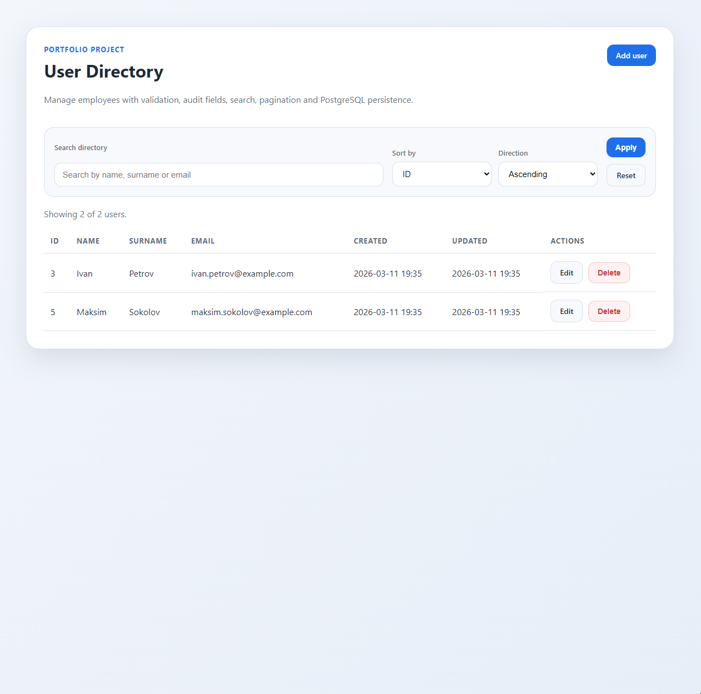
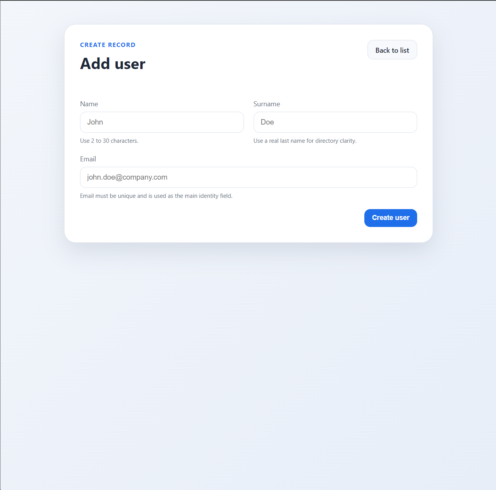
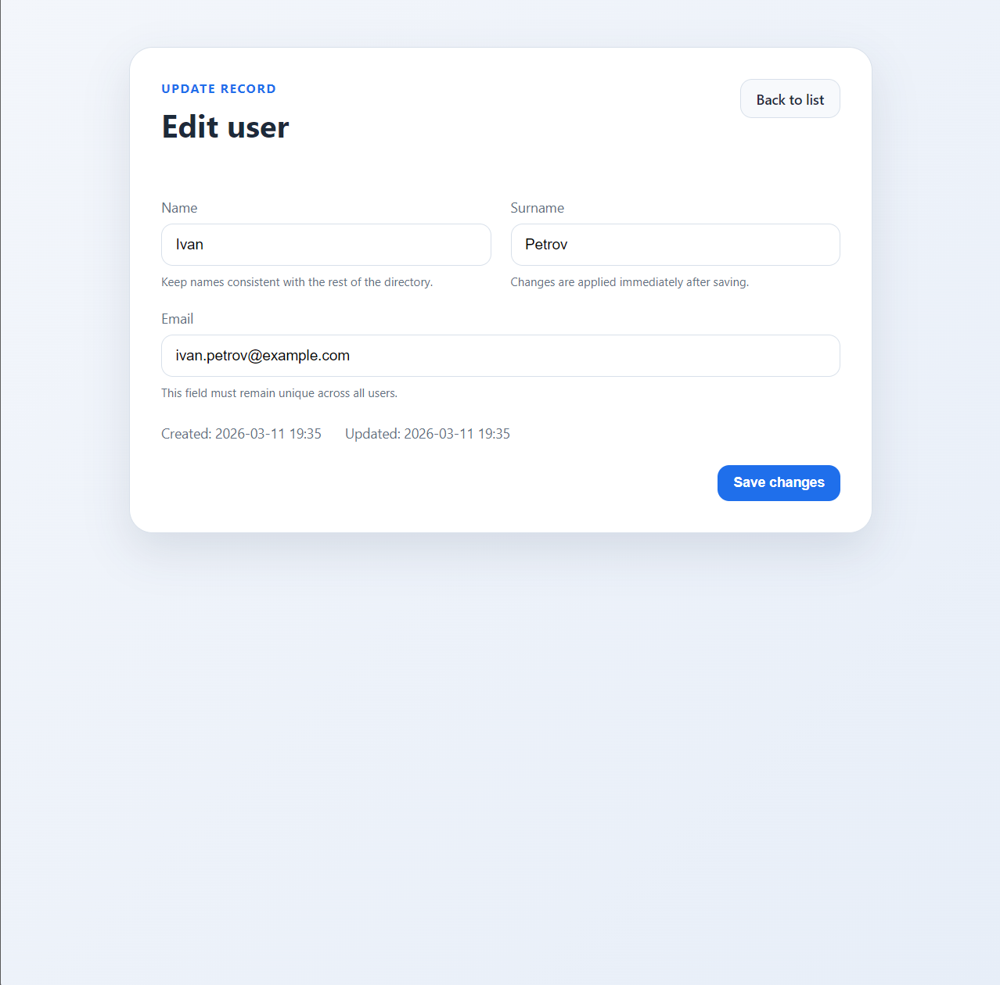
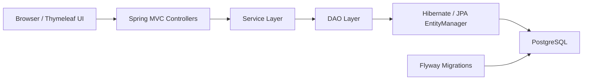

# MVC Hibernate CRUD

[](https://www.oracle.com/java/)
[](https://spring.io/projects/spring-framework)
[](https://www.postgresql.org/)
[](https://flywaydb.org/)
[](https://testcontainers.com/)
[](https://github.com/Jarikjarik/mvc-hibernate-crud/actions)

Production-like portfolio CRUD application for user management built with Spring MVC, Hibernate, Thymeleaf, PostgreSQL, Flyway, Docker and GitHub Actions.

## Why this project stands out

- layered architecture with controller, service and DAO separation
- PostgreSQL persistence with Flyway-managed schema migrations
- HikariCP connection pooling instead of a demo-only datasource setup
- MVC, service and PostgreSQL integration tests
- Dockerized local environment and Maven Wrapper for reproducible setup
- GitHub Actions CI with automated build and test verification
- polished UI with search, sorting, pagination and validation feedback

## Screenshots

### User directory



### Create user



### Edit user



## Features

- create, edit and delete users through a Thymeleaf-based web UI
- validate user input on the server side
- enforce unique email addresses before persistence
- track `createdAt` and `updatedAt` audit fields
- search users by name, surname or email
- sort user list by key fields
- paginate the user directory
- handle application errors through centralized MVC exception handling
- seed demo data and reset the local database explicitly

## Tech stack

- Java 17
- Spring MVC 5
- Hibernate ORM 5
- Thymeleaf
- PostgreSQL
- Flyway
- HikariCP
- Maven Wrapper
- Docker Compose
- JUnit 5
- Mockito
- Testcontainers
- GitHub Actions

## User flows

- `GET /users` - user directory with search, sorting and pagination
- `GET /users/new` - create form
- `POST /users` - create user
- `GET /users/edit?id={id}` - edit form
- `POST /users/edit` - update user
- `POST /users/delete` - delete user

## Architecture



Responsibilities by layer:

- controllers handle HTTP flow, validation feedback and redirects
- services contain business rules and guard clauses
- DAO classes execute persistence queries
- Flyway owns schema evolution instead of Hibernate schema mutation

## Project structure

```text
src/main/java/web
  config/        Spring MVC and database configuration
  controller/    MVC controllers and global exception handling
  dao/           Persistence layer
  model/         JPA entities
  service/       Business logic

src/main/resources
  db.properties
  db.local.properties.example
  db/migration

src/webapp
  WEB-INF/pages
  resources/css

scripts
  reset-db.sql
```

## Configuration

Tracked fallback configuration is stored in `src/main/resources/db.properties` and contains only safe placeholder values.

For local development you can either:

- provide environment variables
- or copy `src/main/resources/db.local.properties.example` to `src/main/resources/db.local.properties`

Configuration priority:

1. environment variables
2. local untracked `db.local.properties`
3. tracked placeholder `db.properties`

Supported overrides:

- `DB_DRIVER`
- `DB_URL`
- `DB_USERNAME`
- `DB_PASSWORD`
- `DB_MAX_POOL_SIZE`
- `DB_MIN_IDLE`
- `DB_CONNECTION_TIMEOUT_MS`
- `HIBERNATE_SHOW_SQL`
- `HIBERNATE_HBM2DDL_AUTO`
- `HIBERNATE_FORMAT_SQL`
- `HIBERNATE_DIALECT`

## Run locally

1. Make sure PostgreSQL is running and the database `mvc-hibernate-crud` exists.
2. Ensure the user `app_user` with password `12345` has access to that database.
3. Copy `src/main/resources/db.local.properties.example` to `src/main/resources/db.local.properties`.
4. Build the project:

```bash
./mvnw clean package
```

For Windows PowerShell:

```powershell
.\mvnw.cmd clean package
```

5. Deploy `target/mvc-hibernate-crud.war` to your servlet container.
6. Open:

```text
http://localhost:8080/mvc-hibernate-crud/users
```

## Run with Docker

1. Copy `.env.example` to `.env` if you want to customize local values.
2. Start the stack:

```bash
docker compose up --build
```

3. Open:

```text
http://localhost:8080/users
```

The Docker setup runs:

- PostgreSQL 17
- Flyway migrations on application startup
- Tomcat with the built WAR deployed as the root app

## Testing

Run the main automated test suite:

```bash
./mvnw test
```

For Windows PowerShell:

```powershell
.\mvnw.cmd test
```

Covered scenarios include:

- service-layer behavior
- MVC controller flow
- root redirect behavior
- search, sorting and pagination flow

Run PostgreSQL integration tests with Testcontainers:

```bash
./mvnw verify -Pintegration-tests
```

For Windows PowerShell:

```powershell
.\mvnw.cmd verify -Pintegration-tests
```

These tests require Docker to be running locally.

## Continuous integration

GitHub Actions runs the following on every push and pull request to `main`:

- Maven dependency restore
- project build
- unit and MVC test suite
- PostgreSQL integration tests with Testcontainers

## Database lifecycle

Schema migrations are stored in `src/main/resources/db/migration`.

Current migrations:

- `V1__create_users_table.sql` - creates the `users` table and indexes
- `V2__seed_users.sql` - inserts demo users for local development

Reset only table contents while keeping the schema:

```bash
psql -U app_user -d mvc-hibernate-crud -f scripts/reset-db.sql
```

Reset the entire Docker database volume:

```bash
docker compose down -v
docker compose up --build
```

## Portfolio value

Signals that this is no longer a tutorial-only CRUD:

- PostgreSQL replaced the original training setup
- schema changes are handled through Flyway migrations
- connection management uses HikariCP
- local environment is reproducible with Maven Wrapper and Docker Compose
- CI verifies build and tests on every push and pull request
- DAO behavior is checked against PostgreSQL with Testcontainers
- UI includes filtering, sorting, pagination and validation feedback

## Next improvements

- add bulk actions or richer directory filters
- add deployment instructions for a public demo environment
