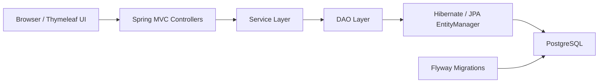

# MVC Hibernate CRUD

Portfolio web application for user management built with Spring MVC, Hibernate, Thymeleaf, Flyway and PostgreSQL.

## Overview

This project started as a basic educational CRUD app and was rebuilt into a more production-like portfolio application.

It now demonstrates:

- classic layered Spring MVC architecture
- explicit database versioning with Flyway
- PostgreSQL-based persistence
- MVC, service and integration test coverage
- reproducible local setup with Maven Wrapper and Docker Compose
- CI validation with GitHub Actions
- real user-list UX with search, sorting and pagination

## Features

- layered architecture: controller, service, DAO
- server-side validation for user forms
- unique email validation before persistence
- audit fields: `createdAt`, `updatedAt`
- Flyway database migrations
- centralized MVC error handling
- Thymeleaf-based UI for listing, creating, editing and deleting users
- user search, sorting and pagination
- seed data and explicit local reset flow

## Stack

- Java 17+
- Spring MVC 5
- Hibernate ORM 5
- Thymeleaf
- PostgreSQL
- Flyway
- Maven Wrapper
- Docker Compose
- Maven WAR packaging
- JUnit 5 and Mockito
- GitHub Actions CI

## Project structure

```text
src/main/java/web
  config/        Spring MVC and database configuration
  controller/    MVC controllers and global exception handling
  dao/           Persistence layer
  model/         JPA entities
  service/       Business logic

src/main/resources
  db.properties
  db/migration

src/webapp
  WEB-INF/pages
  resources/css

scripts
  reset-db.sql
```

## Architecture



Request handling responsibilities:

- controllers manage HTTP flow, validation feedback and redirects
- services hold business rules and guard clauses
- DAO classes execute persistence queries
- Flyway owns schema evolution instead of Hibernate auto-mutation

## User flows

Main pages and actions:

- `GET /users` - paginated user directory with search and sorting
- `GET /users/new` - create form
- `POST /users` - create user
- `GET /users/edit?id={id}` - edit form
- `POST /users/edit` - update user
- `POST /users/delete` - remove user

## Database configuration

Local fallback configuration is stored in `src/main/resources/db.properties`.
The application also supports environment variable overrides for Docker and CI:

- `DB_DRIVER`
- `DB_URL`
- `DB_USERNAME`
- `DB_PASSWORD`
- `HIBERNATE_SHOW_SQL`
- `HIBERNATE_HBM2DDL_AUTO`
- `HIBERNATE_FORMAT_SQL`
- `HIBERNATE_DIALECT`

Current local settings:

- database: `mvc-hibernate-crud`
- username: `app_user`
- password: `12345`
- url: `jdbc:postgresql://localhost:5432/mvc-hibernate-crud`

For sharing or future deployment use `src/main/resources/db.properties.example` as a template.

## Run locally

1. Make sure PostgreSQL is running and the database `mvc-hibernate-crud` exists.
2. Ensure the user `app_user` with password `12345` has access to that database.
3. Build the project with Maven Wrapper:

```bash
./mvnw clean package
```

For Windows PowerShell:

```powershell
.\mvnw.cmd clean package
```

4. Deploy the generated WAR from `target/mvc-hibernate-crud.war` to your servlet container.
5. Open:

```text
http://localhost:8080/mvc-hibernate-crud/users
```

## Run with Docker

1. Copy `.env.example` to `.env` if you want to customize local values.
2. Start the stack:

```bash
docker compose up --build
```

3. Open:

```text
http://localhost:8080/users
```

The Docker setup runs:

- PostgreSQL 17
- Flyway migrations on application startup
- Tomcat with the built WAR deployed as the root app

## Testing

Run the automated test suite with Maven Wrapper:

```bash
./mvnw test
```

For Windows PowerShell:

```powershell
.\mvnw.cmd test
```

Covered scenarios include:

- service-layer behavior
- MVC controller flow
- root redirect behavior
- search, sorting and pagination flow

Optional PostgreSQL integration tests are also available through Testcontainers:

```bash
./mvnw verify -Pintegration-tests
```

For Windows PowerShell:

```powershell
.\mvnw.cmd verify -Pintegration-tests
```

These tests require Docker to be running locally.

## Continuous integration

GitHub Actions runs the following on every push and pull request to `main`:

- Maven dependency restore
- project build
- unit and MVC test suite
- PostgreSQL integration tests with Testcontainers

## Portfolio value

Signals that this is no longer a tutorial-only CRUD:

- PostgreSQL replaced the original training setup
- schema changes are handled through Flyway migrations
- local environment is reproducible with Maven Wrapper and Docker Compose
- CI verifies build and tests on every push and pull request
- DAO behavior is checked against PostgreSQL with Testcontainers
- UI includes filtering, sorting, pagination and user feedback states

## Flyway migrations

Schema migrations are stored in:

```text
src/main/resources/db/migration
```

Current migrations:

- `V1__create_users_table.sql` - creates the `users` table and indexes
- `V2__seed_users.sql` - inserts demo users for local development

## Data lifecycle

By default the application keeps data between restarts.
This is the recommended behavior for the portfolio version of the project.

For local development and demos you have two reset options.

Reset only table contents while keeping schema:

```bash
psql -U app_user -d mvc-hibernate-crud -f scripts/reset-db.sql
```

After that the application starts with an empty `users` table.

Reset the entire Docker database volume:

```bash
docker compose down -v
docker compose up --build
```

That recreates PostgreSQL from scratch and reapplies all migrations, including demo seed data.

## Current status

The project has been upgraded from a basic educational CRUD toward a more production-like portfolio application:

- PostgreSQL configured instead of MySQL
- cleaner Spring configuration
- better validation and user feedback
- audit fields and unique email support
- improved UI and error handling
- explicit database migration instead of implicit schema mutation
- managed seed data and explicit database reset flow
- reproducible build via Maven Wrapper
- automated test coverage for service and MVC layers
- optional PostgreSQL integration tests with Testcontainers
- GitHub Actions build validation
- containerized local environment via Docker Compose
- searchable and paginated user directory UI

## Next improvements

- add screenshots or demo GIFs to the repository
- add bulk actions or richer directory filters
- add deployment instructions for a public demo environment
